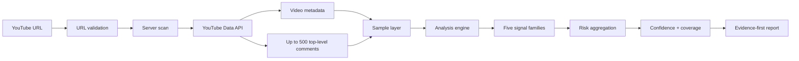

<p align="center">
  
</p>

<h1 align="center">D.i.D — Dead Internet Detector</h1>

<p align="center">
  Engagement authenticity intelligence.
</p>

<p align="center">
  <a href="https://x.com/Orionstraped"></a>
  
  <a href="https://ko-fi.com/deadinternetlab"></a>
  
  
</p>

> **Having doubts? Ask D.i.D. 🧪**

D.i.D analyzes public YouTube comment activity for patterns associated with suspicious, synthetic, repetitive, or coordinated engagement.

It is an **evidence-first triage tool**, not a bot verdict engine. D.i.D shows the measurements behind each result, explains confidence and sample coverage, and includes ordinary explanations that may also fit the observed pattern.

## What D.i.D measures

Current scans evaluate five signal families:

| Signal | What it measures |
| --- | --- |
| **Comment Repetition** | Reused normalized wording across sampled comments |
| **Timing Bursts** | Dense arrival windows containing unusually concentrated account activity |
| **Conversation Depth** | How often sampled top-level comments receive replies |
| **Language Diversity** | Lexical variety in usable comment text |
| **Link Presence** | Share of sampled comments containing HTTP(S) links |

D.i.D currently Pulls up to **500 public top-level comments** from a YouTube video URL.

A report includes:

- Engagement-risk score
- Risk band: **Low / Moderate / Elevated / High**
- Analysis confidence
- Sample coverage
- Per-signal evidence
- Raw signal contributions
- Strong-domain corroboration
- Possible benign explanations
- Timeline context
- Versioned scoring metadata

> D.i.D does not prove that an account is a bot, that engagement was purchased, that activity was coordinated, or that a creator caused it.

## Inside D.i.D



The scan layer starts metadata and comment collection in parallel, reuses matching in-flight requests, and keeps a short-lived **60-second server-side cache**. YouTube comment pages themselves are still fetched sequentially because each later page depends on the previous page token.

## Scoring

Current production versions:

- `scoringVersion: corroborated-v2`
- `confidenceVersion: sample-evidence-v3`

### Risk bands

| Score | Band |
| ---: | --- |
| 0–27 | Low |
| 28–49 | Moderate |
| 50–69 | Elevated |
| 70–100 | High |

### Raw contributions

| Signal | Current contribution |
| --- | --- |
| Repetition | `1.4 × repeated-comment percentage` |
| Timing | `0.8 × dense-window account-appearance percentage` |
| Language Diversity | `max(0, 0.35 - TTR) × 120` when lexical evidence exists |
| Conversation Depth | `+8` when reply activity is below the review threshold |
| Link Presence | link percentage when it reaches the review threshold |

### Corroboration

Strong evidence is grouped into two domains:

- **Content:** repetition, vocabulary, and links
- **Timing:** dense timing bursts

A single strong domain cannot push the overall result into **High** by itself. Without strong evidence in both content and timing, the overall score is capped below the High band.

This is a conservative scoring rule, **not a calibrated probability model**.

## Language evidence

If text normalization leaves no usable lexical tokens — for example an emoji-only sample — Language Diversity becomes unavailable instead of suspicious:

```text
availability: insufficient-evidence
TTR: null
risk contribution: 0
```

Unavailable evidence is not treated as suspicious evidence and is not treated as proof that nothing suspicious exists.

The current lexical metric still uses type-token ratio (TTR), which is known to be sensitive to sample size. Real-world stability work has already shown that this can move scores across different sample sizes drawn from the same comment pool. A length-normalized replacement remains an active research priority.

## Analysis confidence

Confidence is **not** a probability that D.I.D. is correct and is **not** an estimate of bot percentage.

It currently reflects:

- number of comments analyzed
- approximate coverage when YouTube reports a usable comment total
- whether expected signal inputs were available

Unknown coverage earns no coverage bonus. If a signal cannot be evaluated, confidence is reduced instead of pretending the signal was measured successfully.

## API

D.i.D exposes the scan engine through:

```http
POST /api/scan
Content-Type: application/json
```

Request:

```json
{
  "url": "https://www.youtube.com/watch?v=..."
}
```

Responses include scan results plus versioning and evidence metadata such as:

- `scoringVersion`
- `confidenceVersion`
- `aggregation`
- `evidenceAvailability`
- `unavailableSignals`

The API is also used by **IRIS**, the Dead Internet Lab Discord assistant.

## Validation philosophy

D.i.D includes reproducibility and stability testing around:

- repeated real captures
- overlap / Jaccard comparison
- score and confidence deltas
- per-signal contribution deltas
- chronological windows
- seeded random disjoint partitions

**Stability is not accuracy.** A detector can produce the same answer repeatedly and still be wrong. D.i.D therefore treats stability, correctness, and calibration as separate questions.

## Roadmap

- Length-normalized lexical diversity
- Semantic duplicate detection
- Account coordination clustering
- Channel baselines and creator comparisons
- Comments-per-1,000-views context
- Comment spike vs view spike timing
- YouTube Live monitoring
- Twitch monitoring
- Research dashboard
- Public/shareable scan reports
- Expanded API access

## Status

🚧 **Active development**

Current focus:

- reducing false positives
- improving sample-size stability
- validating scoring behavior on real captures
- making evidence and uncertainty easier to understand
- improving scan speed and truthful progress reporting

## Live Demo

[Open the D.i.D prototype](https://id-preview--3ab3a152-986b-4bff-9047-7f0d593a3df6.lovable.app)

## Dead Internet Lab

D.i.D is being developed under **LarpCentral / Dead Internet Lab**.

- Follow development: [@Orionstraped](https://x.com/Orionstraped)
- Support the project: [Ko-fi](https://ko-fi.com/deadinternetlab)
- Community: **larpHQ** on Discord

## Philosophy

> **Show the evidence. Show the uncertainty. Let the human decide.**

The goal is not to turn messy internet behavior into a magic “bot detector.” The goal is to make suspicious engagement easier to inspect, compare, question, and understand.
